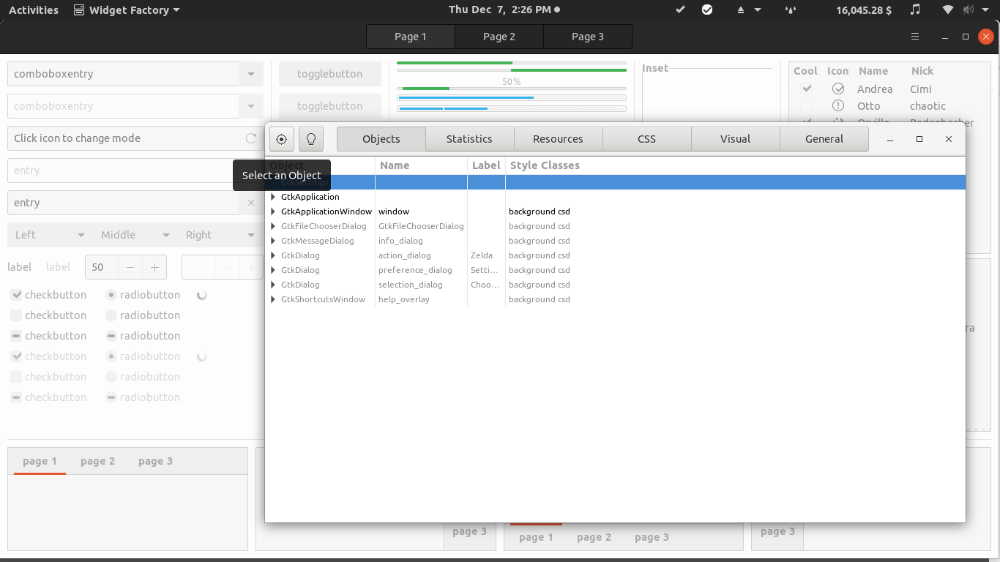
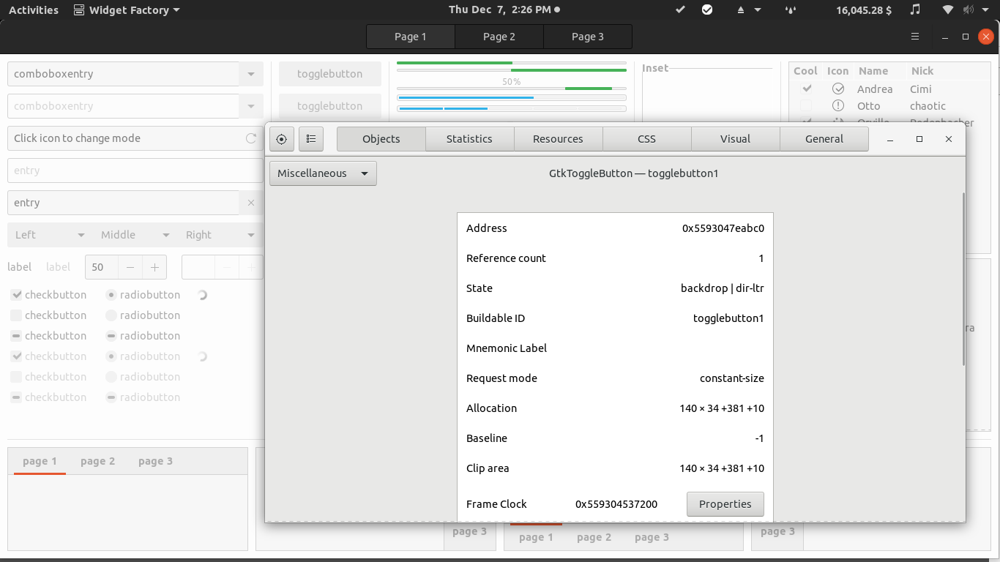
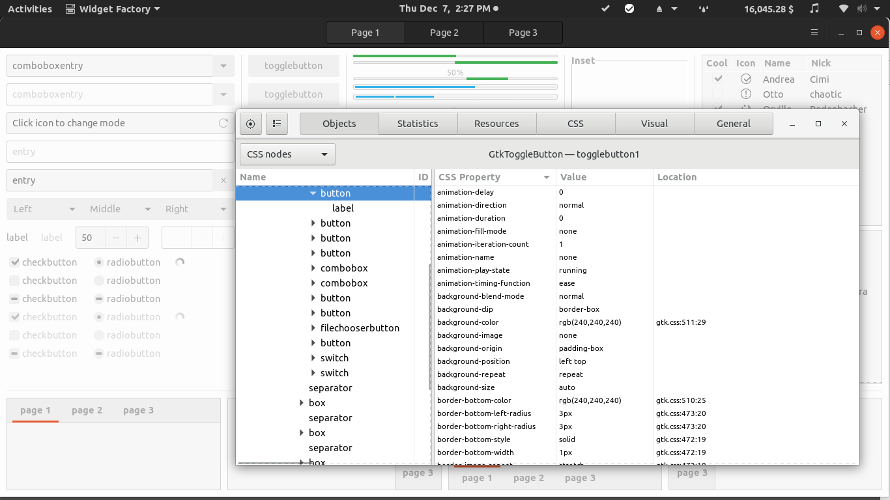
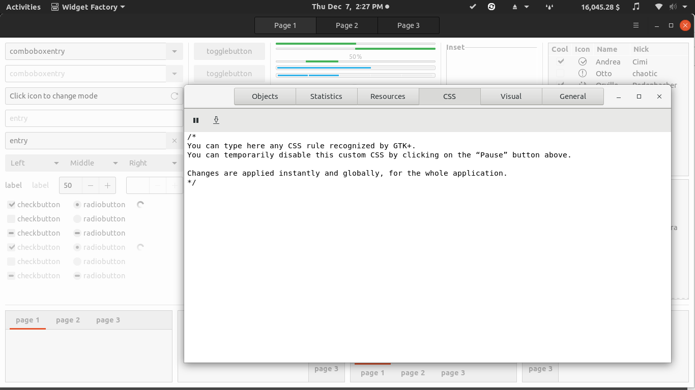

# Contributing to Yaru

Yaru consists of one project with 3 distinct parts.

- `gnome-shell` directory is the theme for GNOME Shell. This themes stuff like the calendar widget, the Ubuntu dock, the top panel, the login screen and more. It derives from upstream GNOME Shell theme.
- `gtk` contains the themes GTK+2 and GTK+3. This specifies how applications like Files, Terminal, Ubuntu Software look. It derives from upstream Adwaita GTK+2 and GTK+3 themes.
- `sound` contains all sound themes related information, combining both [WoodenBeaver](https://github.com/madsrh/WoodenBeaver) and [Touch-Remix](https://github.com/madsrh/TouchRemix).
- `suru-icon-theme` contains all the icons, derives from the [Suru icon](https://snwh.org/suru) theme.

## Build and install themes from source

This installation method is to try out the theme while developing it. If you're not a developer, follow the instructions in the [README.md](./README.md).

```bash
# Needed before install
sudo apt install libgtk-3-dev git meson sassc
# Download the repository from github
git clone https://github.com/ubuntu/yaru.git
cd yaru
# Initialize build system (only required once per repo)
meson build
cd build
# Build and install
sudo ninja install
```

If you want to change the GDM look and point to the same stylesheet. You only need to do this once.

```sh
update-alternatives --install /usr/share/gnome-shell/theme/gdm3.css gdm3.css /usr/share/gnome-shell/theme/Yaru/gnome-shell.css 15
```

If you reboot, select the Yaru session in GDM and you should be all right.

### More granular changes

Now everything should be in place. Select the GTK and sound theme via:
```bash
gsettings set org.gnome.desktop.interface gtk-theme Yaru
gsettings set org.gnome.desktop.sound theme-name Yaru
```

The GTK2 and GTK3 files go into `/usr/local/share/themes/Yaru`. The shell files go into `/usr/local/share/gnome-shell/theme/Yaru`. You can edit the `gtk.css` and `gnome-shell.css` files in those folders directly for testing, or you can edit the SCSS files inside the folder you cloned from GitHub.

SCSS is the actual "source code" of the theme. This is compiled into the CSS files. Edit the SCSS if you want to contribute your changes back to us. SCSS is simple enough to get the hang of if you already know CSS. You can go through [this SCSS tutorial](http://marksheet.io/sass-scss-less.html) to learn more. After making your edits in the SCSS files, you can run `sudo ninja install` in the `yaru/build` folder. That’ll do all the compiling and installing.

Changes to Gnome Shell theme are visible after doing <kbd>Alt</kbd> + <kbd>F2</kbd> and running <kbd>r</kbd> as command. The changes to GTK theme will be visible after running the following commands.

```bash
# To reload GTK theme
# Change to Adwaita theme and back to Yaru
gsettings set org.gnome.desktop.interface gtk-theme Adwaita
gsettings set org.gnome.desktop.interface gtk-theme Yaru
# To reload icon theme
# Change to Humanity icon theme and back to Yaru
gsettings set org.gnome.desktop.interface icon-theme Humanity
gsettings set org.gnome.desktop.interface icon-theme Yaru
```

### Testing desktop-login sound

Type in a terminal `gnome-session-properties`. It'll give you the list of starting applications. Click on "add", and type the following informations in the dialog shown :

- **Name:** `GNOME Login Sound`

- **Command:** `/usr/bin/canberra-gtk-play --id="desktop-login" --description="GNOME Login"`

- **Comment:** `Plays a sound whenever you log in`

---

### Testing from the desktop

A quick and easy way to test if the sounds are installed correctly, is by triggering them from the desktop. Here's a few places that will trigger a notification:

- Open a texteditor (like Gedit or even the terminal) and press backspace or delete
- Open two tabs in Firefox and close the window
- Adding / removing a USB drive
- Clicking the volumeslider in the system menu in the top right corner


## Quick testing in the GTK Inspector

To do some quick testing you can also use the GTK Inspector.

```bash
# Install inspector
sudo apt install libgtk-3-dev
# Enable the shortcut to open it
gsettings set org.gtk.Settings.Debug enable-inspector-keybinding true
```

Now you can open any program GTK3 program and press <kbd>CTRL</kbd> + <kbd>Shift</kbd> + <kbd>D</kbd> to bring up the inspector.

The most useful program to use with the inspector is the widget factory though. Which shows you basically every widget. Run `sudo apt install gtk-3-examples`, then run `gtk3-widget-factory` That will open the widget factory, then you can open the inspector with <kbd>CTRL</kbd> + <kbd>Shift</kbd> + <kbd>D</kbd> again.

Click the upper-left target button to select an object.



Select something like a button and you’ll see the following.



We don’t really care too much about that stuff so just click the dropdown button with “Miscellaneous” and select CSS nodes. Which shows you:



The element you selected will be highlighted within a list of *all elements* in the window. In the left pane you can see the name of the widget you clicked on (button) and its different CSS classes (.text-button .toggle). The right pane shows all the element’s CSS properties and values and where to find it in the gtk.css file. You can see all supported CSS properties in the inspector, but for something more detailed look at the [Gnome CSS Properties reference](https://developer.gnome.org/gtk3/stable/chap-css-properties.html).

Clicking the CSS tab will take you to a text entry window where you can type in CSS that will be applied.



Putting button `{ background-color: red; }` will make all buttons have a red background. It’s exactly like the inspect element tool in a web browser.

## Why do we import from package content and not from upstream git repository?

We sync our version to be compatible with the GTK and GNOME Shell versions being in ubuntu repositories. This is why we sync from them (or rebase them as soon as we update a new version with changes in ubuntu).

## GTK: What is removed from the initial directory?

We remove on new version import:

- `*.in`, `Makefile.*`, `meson.build`: we have our own build system.
- `adwaita_engine.c`: we use the default adwaita engine
- `*.css`: we build these from the `*.cscc` sources
