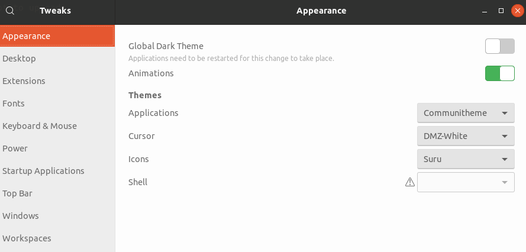

# Ubuntu Communitheme

Communitheme is the new Ubuntu theme build by the Community.

## Install the daily build of Communitheme

 We're currently still developing the theme, but you can try it out for yourself. Be warned though, this is a pre-release alpha state. These packages are mainly intended for the Communitheme designers to get a sense of what actually works in Ubuntu. **Many icons are missing, some stuff is just a white squircle. You will find issues and stuff will break.**

*Note: these instructions install the entire Communitheme session; this includes the Gnome Shell, GTK and icon theme.*

```bash
# First, make sure the old versions are removed
sudo apt remove suru-icon-theme gtk-communitheme gnome-shell-communitheme ubuntu-communitheme-session

# Add the PPA to your repository list
sudo add-apt-repository ppa:communitheme/ppa
# Download a list of all the software that's available from the repositories
sudo apt update
# Download and install the actual software
sudo apt install suru-icon-theme gtk-communitheme gnome-shell-communitheme ubuntu-communitheme-session
```

And it's installed! Restart your computer, the login screen will use Communitheme by default. Select the "Ubuntu Communitheme" session from the login screen (click the gear) and login. This will start the GNOME-Shell, GTK2, GTK3 and icon themes.

*You might need to manually specify the themes in "Gnome Tweaks" after logging in. Set the themes as specified in the image below.*



## Upgrade the daily build of Communitheme

These packages are built from the github repositories daily. Anything that's committed to the `master` branch of the github repository will be available in the repository in a day. These packages are automatically updated by the Ubuntu updater. You can manually update them using the following commands.

```bash
# Get a list of the latest software that's available in the repositories
sudo apt update
# Upgrade your packages to the latest version
sudo apt upgrade
```

## I want to contribute!

Great, we're looking forward to your PR!

Read [CONTRIBUTING.md](./CONTRIBUTING.md) to figure out how to get started.
