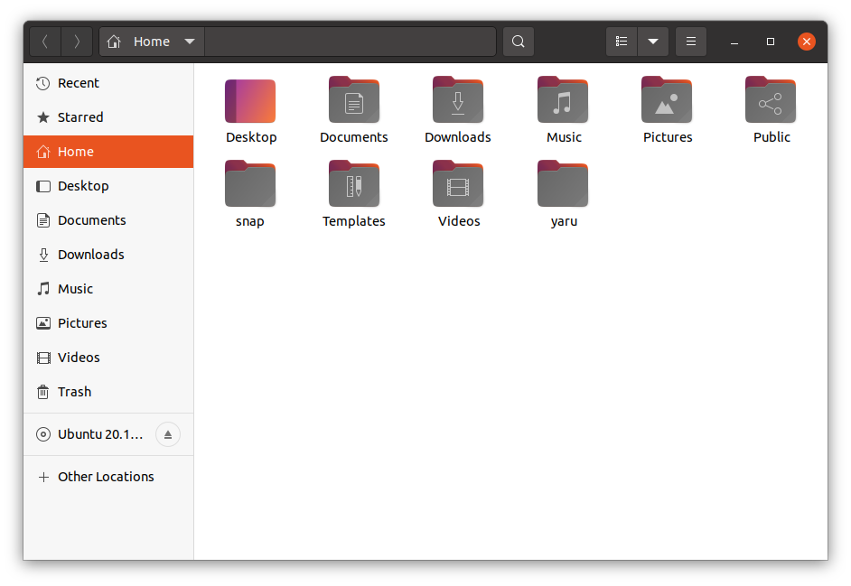
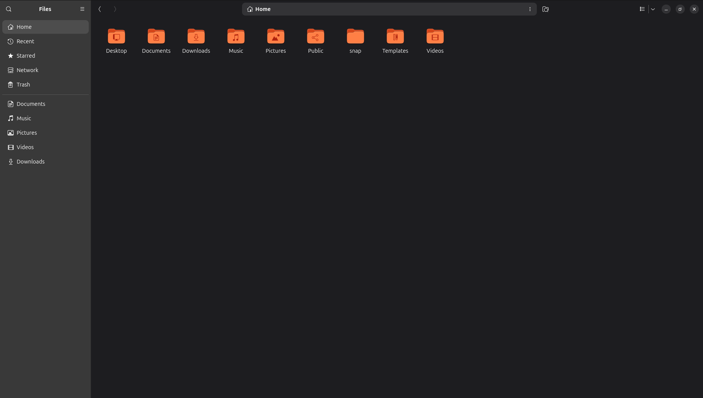
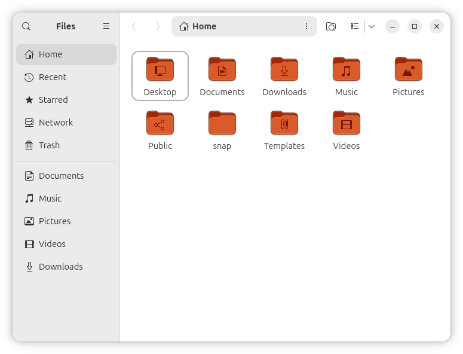
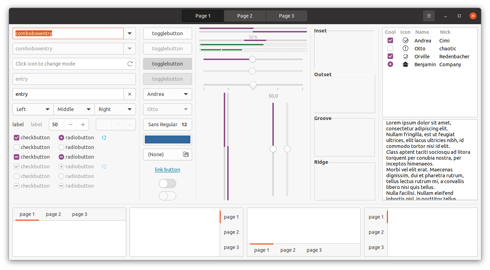
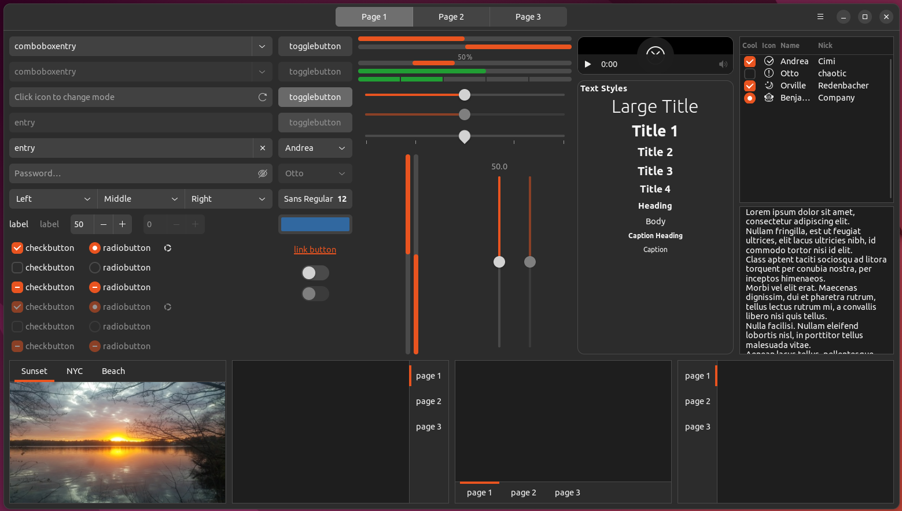
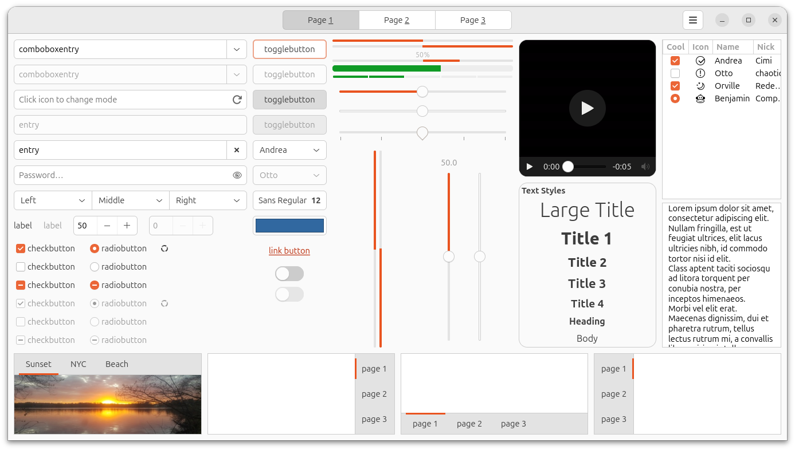
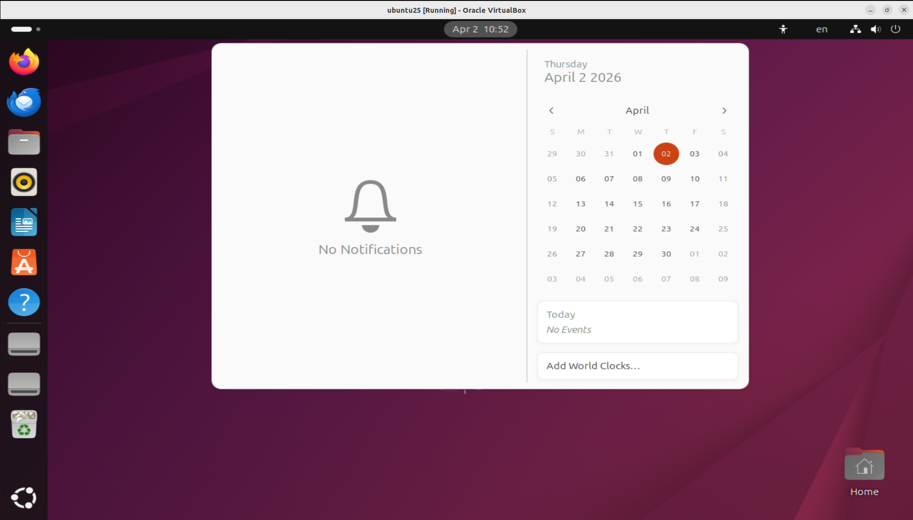
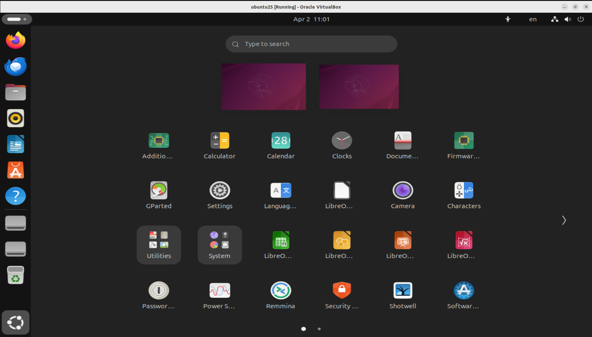

# Ubuntu Yaru theme suite

Snap build status: 

Yaru is the default theme for Ubuntu, backed by the community.

It contains:
 * a GNOME Shell theme based on the [upstream GNOME shell theme](https://github.com/GNOME/gnome-shell/tree/master/data/theme)
 * a light and dark GTK theme (gtk2 and gtk3) based on the [upstream Adwaita Gtk theme](https://github.com/GNOME/gtk/tree/gtk-3-24/gtk/theme/Adwaita)
 * an icon & cursor theme, derived from the Unity8 Suru icons and [Suru icon](https://snwh.org/suru) theme
 * a sound theme, combining sounds from the [WoodenBeaver](https://github.com/madsrh/WoodenBeaver) and [Touch-Remix](https://github.com/madsrh/TouchRemix) sound themes.
 

## Using yaru on Ubuntu

The Yaru theme suite is installed with Ubuntu 18.10+ by default! No further steps are required to use it.

_Installing from source is not recommended for average usage!_

## Using a legacy Yaru/Communitheme version on Ubuntu 18.04 (bionic beaver) via snap installation

> Note that for backward compatibility, we kept the name "communitheme" for bionic beaver. Only icon and sound updates will be pushed into this version of the theme suite.

_These steps only work on Ubuntu 18.04 (bionic beaver)! DO NOT install the snap on 18.10+ installations!_

Follow these steps in order to install and enable communitheme.

1. Install the communitheme snap on 18.04 by installing `communitheme` in the Ubuntu Software Application or running `snap install communitheme`.
2. Restart your computer.
4. Click on your user, click on the gear icon and select the "Ubuntu with communitheme snap" session from the pop-up, and login.
3. Now Ubuntu is using the communitheme including the system, applications, icons, sounds and the cursor.

## Copying or Reusing

This project has mixed licencing. You are free to copy, redistribute and/or modify aspects of this work under the terms of each licence accordingly (unless otherwise specified).

The Suru icon assets (any and all source `.svg` files or rendered `.png` files) are licensed under the terms of the [Creative Commons Attribution-ShareAlike 4.0 License](https://creativecommons.org/licenses/by-sa/4.0/).

Included scripts are free software licensed under the terms of the [GNU General Public License, version 3](https://www.gnu.org/licenses/gpl-3.0.txt).

## I want to be part of it!

Great, we're looking forward to your PR!

Read [CONTRIBUTING.md](./CONTRIBUTING.md) to figure out how to get started.
