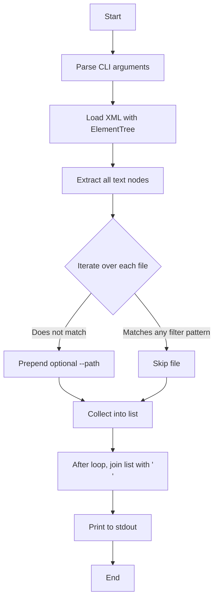

# gnome-shell/src Module Documentation

## 1. Module Identity
The **`gnome-shell/src`** directory contains helper scripts that are used during the build process of the Yaru GNOME Shell theme.  At present the only script in this module is **`gresources-xml-parser.py`**, which parses a *gresource* XML manifest and emits a flat list of resource file paths.  This list is later consumed by the Meson/Ninja build pipeline to generate the compiled GResource binary that the GNOME Shell loads at runtime.

---

## 2. Interface Contract
### Executable: `gresources-xml-parser.py`
| Element | Description |
|---------|-------------|
| **Command** | `python3 gresources-xml-parser.py <gresource_source> [--path <prefix>] [--filter <pattern> ...]` |
| **Positional argument** | `gresource_source` – a path to the XML file that defines the `<gresource>` entries (opened with `argparse.FileType('r')`). |
| **Optional argument** | `--path` – a string that is prepended to every emitted file path. Default is an empty string. |
| **Optional argument** | `--filter` – one or more glob patterns (e.g., `*.png`) that should be excluded from the output. The flag can be repeated; all patterns are combined with logical **OR**. |
| **Output** | A newline‑separated list printed to **stdout** containing the absolute (or prefixed) paths of all `<file>` elements that are **not** filtered out. |
| **Exit status** | `0` on success, non‑zero on parsing errors (e.g., malformed XML). |

**Example usage**
```bash
# List all files in the gresource XML, ignoring any SVG assets
python3 gresources-xml-parser.py data/theme/gnome-shell-sass/yaru.gresource.xml \
    --path "$MESON_BUILD_ROOT" \
    --filter "*.svg"
```
The command prints something like:
```
$MESON_BUILD_ROOT/data/theme/gnome-shell-sass/gtk-3.0/gtk.css
$MESON_BUILD_ROOT/data/theme/gnome-shell-sass/gtk-3.0/gtk-dark.css
```
---

## 3. Logic Flow

1. **Argument parsing** – `argparse` builds a parser that requires a readable XML file and optionally receives a path prefix and one‑or‑more filter globs.
2. **XML loading** – `ET.ElementTree` reads the file name supplied via `args.gresource_source.name`.
3. **File extraction** – `source_files = [f.text for f in gsource_xml.findall('.//gresource/file')]` gathers the raw filenames defined inside the `<gresource>` element.
4. **Filtering** – For each filename `f`, a list‑comprehension checks `fnmatch.fnmatch(f, fl)` against every pattern in `args.filter`. If any pattern matches, the file is omitted.
5. **Path prefixing** – Non‑filtered filenames are joined with the optional `--path` value using `os.path.join`.
6. **Output** – The final list is printed as a single newline‑separated string.
---

## 4. Dependencies
| Dependency | Type | Reason |
|------------|------|--------|
| `argparse` | Python standard library | CLI argument handling. |
| `fnmatch` | Python standard library | Glob‑style pattern matching for `--filter`. |
| `os` | Python standard library | Path manipulation (`os.path.join`). |
| `xml.etree.ElementTree` | Python standard library | Lightweight XML parsing of the gresource manifest. |

The script does **not** rely on any third‑party packages, making it portable across any environment that provides Python 3.8+ (the version used by the Yaru build system).  It is typically invoked from Meson build definitions (`meson.build`) to generate the list of resources that will be compiled into `yaru-shell.gresource`.

---

## 5. Localization Note
This README is written in English and intended for developers working on the Yaru theme.  If a translated version is required, the same structure can be reproduced in the target language while preserving code snippets and command‑line syntax.
